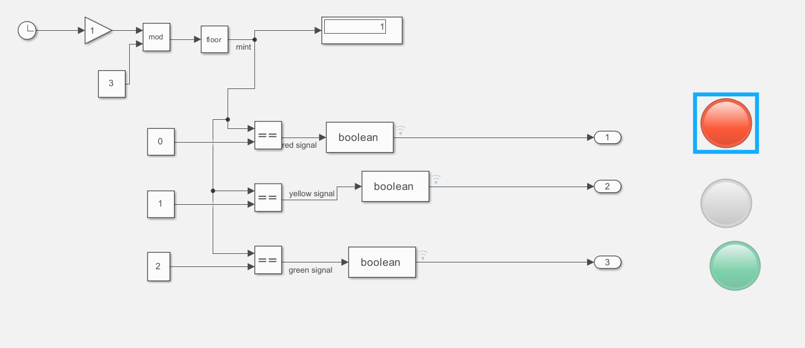

# Traffic Light System (Realm)

This repository contains a Simulink model of a **Traffic Light Control System**, created for the MATLAB Simulink Student Challenge 2025.

## Objective
To simulate a modular traffic light controller using subsystems and a multiport switch.

## Model Overview
- A clock signal is processed through divide, floor, and modulo blocks to cycle through states 0, 1, and 2.
- A Multiport Switch routes the state to one of three subsystems:
  - **Red Subsystem** → outputs `red_signal`
  - **Yellow Subsystem** → outputs `yellow_signal`
  - **Green Subsystem** → outputs `green_signal`
- Each signal is connected to a Lamp block to visually represent the traffic light state.

## Features
- Modular design using subsystems for clarity and scalability.
- Boolean outputs ensure clean lamp activation.
- Visual indicators (Lamps) show active traffic light state.

## Files
- `TrafficLightSystem.slx` — Simulink model file.
- `/images/model_diagram.png`
- 
## Model Screenshot

## Author
Shubham Sirsat 
